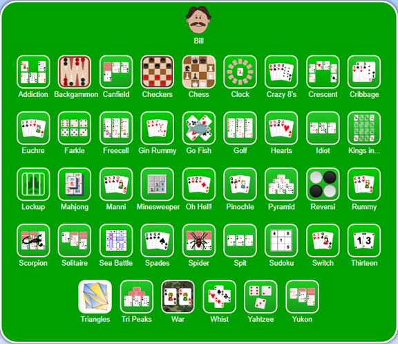
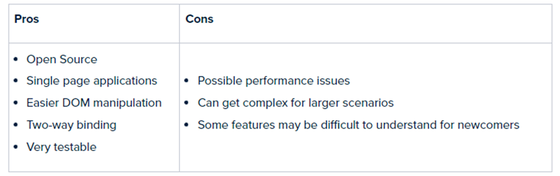
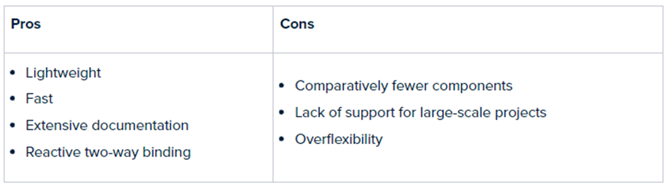

# Card Games

#### Een web applicatie voor kaartspellen. In dit document leg ik alles uit wat nodig is voor het maken van de applicatie.

***

***

## Content

[Beschrijving](link)
***

# Beschrijving

Doormiddel van een inlog system van google ga ik iedereen een account toe wijzen om zo de scores etc. bij te houden.
Wanneer je een spel wilt spelen dan kun je er zelf eentje aanmaken of een joinen met een gamepin. De host bepaalt
uiteindelijk wanneer het begint etc.

## Inspiratie

Hieronder zie je het idee vanuit een bestaande app.

Bron: https://cardgames.io/
***

# User stories

Hieronder staan de user stories beschreven met daarbij de acceptatiecriteria.

1. **Als kaartspeler wil ik een overzicht krijgen van kaartspellen zodat ik er uiteindelijk een kan kiezen om te
   spelen.**
    - Ik zie een lijst van spellen die beschikbaar zijn
    - Ik zie per spel de moeilijkheid, naam, mix/max spelers
    - Ik moet op een spel kunnen klikken om vervolgens door te gaan
    - Alle acceptatiecriteria moeten getest zijn

2. **Als kaartspeler moet ik een spel kunnen joinen zodat je tegen andere gebruikers kan spelen**
    - Ik kom een queue terecht waarin andere spelers kunnen joinen
    - Je ziet de spelers die mee doen aan het spel
    - Je ziet de gamepin van het huidige spel
    - Als host kan je het spel starten
    - Als deelnemer kan je niet starten, wel wachten
    - Alle acceptatiecriteria moeten getest zijn

3. **Als kaartspeler wil ik een spel kunnen spelen tegen andere gebruikers**
    - Ik krijg een deck kaarten in mijn hand
    - Je ziet of je aan de beurt bent
    - Je ziet wie er op dit moment aan de beurt is
    - Je kan een overzicht zien van de score op dat moment indien dit bij het spel hoort
      (verschilt )
    - Wanneer een of meerdere spelers winnen krijgt de rest van de gebruikers dit te zien
    - Wanneer een of meerdere spelers verliezen krijgt de rest van de gebruikers dit te zien
    - Alle acceptatiecriteria moet getest zijn

***

# Requirements

## Functionele requirements

### User stories

1. Als kaartspeler wil ik een overzicht krijgen van kaartspellen zodat ik er uiteindelijk een kan kiezen om te spelen.
2. Als kaartspeler moet ik een spel kunnen joinen zodat je tegen andere gebruikers kan spelen
3. Als kaartspeler wil ik een spel kunnen spelen tegen andere gebruikers

### Use cases:

- Wanneer een gebruiker de app opent, de eerste pagina is de homepage
- Vanuit de homepage zal de gebruiker naar het inloggen moeten kunnen gaan
- Bij het inloggen dient de gebruiker in te loggen met Google of alleen de naam
- Na het inloggen kan de gebruiker een bestaand spel joinen
- Na het inloggen kan de gebruiker een nieuw spel aanmaken
- Na het aanmaken van een nieuw spel kom je in een queue terecht
- In de queue kan iedereen joinen die mee wilt doen aan het spel
- Als host zijnde kan je het spel starten
- Elke deelnemer kan de bepaalde acties uitvoeren die in het spel zitten

### Additional Functionality:

- API communicatie

***

## Niet functionele requirements

### Performance:

Het laden en schrijven van data is prioriteit, omdat het real time met elkaar communiceert is het belangrijk dat alles
soepel verloopt en dus iedereen het spel goed kan spelen.

### Usability:

- Gebruikers kunnen inloggen of alleen hun naam invullen
- Gebruikers kunnen een spel joinen en hosten

### Reliability and Scalability:

Door gebruik van microservices zal de applicatie erg snel moeten zijn. Alles is netjes op gesplitst. Er komt een API
voor Games informatie en Sessions. De API van de Sessions zullen veel meer gebruikt worden waardoor er hier dus meer
ruimte wordt voor gemaakt. De Games API wordt alleen gebruikt om spellen weer te geven.

### Safety:

De gegevens van de gebruiker wanneer ingelogd zullen veilig worden opgeslagen. Ook wanneer je een game speelt zullen
deze gegevens alleen toegankelijk zijn voor de spelers die mee doen aan het spel.
***

# Backend Programming Framework
## Onderzoek
Voor de backend ga ik onderzoek doen voor welke backend ik ga gebruiken. Voorafgaand van het
onderzoek zit ik te twijfelen tussen Java en C#.

### Java
Java, ontwikkeld door James Gosling in 1995, is een op klassen gebaseerde objectgeoriënteerde taal
voor algemene doeleinden, die ook netwerkgericht is en weinig implementatie-afhankelijkheden
heeft. Voordat Java zich uitbreidde en wereldwijd een van de meest gebruikte programmeertalen
werd, was het bedoeld als kleinschalige technologie die exclusief was gereserveerd voor interactieve
kabel-tv. Java's beroemde paradigma en motto "Eén keer schrijven, overal uitvoeren" weerspiegelt
de flexibiliteit en draagbaarheid van de taal, die inherent platform-, OS- en compileronafhankelijk is.

### C#
C# is een algemene, objectgeoriënteerde en componentgeoriënteerde typeveilige programmeertaal,
ontwikkeld door Andres Hejlsberg en zijn team bij Microsoft in het jaar 2000. Deze taal draait op het
.NET-platform. Het maakt ook deel uit van Microsoft Visual Studio en heeft native ondersteuning
voor Windows OS-toepassingen. Moderniteit in functies en eenvoud in code zijn de twee pijlers van
C#-ontwerp. Het wordt continu bijgewerkt met hedendaagse elementen en maakt talrijke integraties
mogelijk.
Interessant genoeg is C# oorspronkelijk ontwikkeld als het antwoord van Microsoft op Java vanwege
de toenemende populariteit van Java aan het einde van de millennia.

### Vergelijken
Van wat ik lees over heel het internet, is dat C#, als het gaat om game development liever gekozen
wordt. Java daarin tegen kan ook gebruikt worden (kijk naar Minecraft).

### Conclusie
Aangezien ik C# al ken en Java niet de meest gebruikte taal meer is de laatste tijd, ga ik gebruik
maken van C#. Dit doe ik om hier mijn kennis van te verbreden en denk hier in de toekomst meer te
maken mee ga krijgen.
***

# Frontend Programming Framework
## Onderzoek
Ik zit te twijfelen tussen Angular en VueJS. Beide heb ik ze niet tot weinig gebruikt. Angular nog
helemaal niet, VueJS vorig semester met de proftaak.

### Angular

### VueJS

### Conclusie
Ik vind dat ik VueJs niet goed genoeg ken om te zeggen dat ik het helemaal onder de knie heb. Mijn
keuze wordt daarom dus ook VueJs. Ook omdat je bij VueJs alles zelf kan inrichten, Angular zit je vast
aan een structuur.

Ik ga Vite + VueJs, Vite is een frontend tooling dat erg snel is. Vite kan met verschillende frameworks
gebruikt worden waaronder ReactJS en VueJs. Ik ga het dus samen gebruiken met VueJs.

**Bron:** https://hackr.io/blog/best-javascript-frameworks
***

# Microservices
De microservices ga ik opzetten doormiddel van Docker. Docker maakt images aan die je kan runnen
op elk OS. Met “docker compose” kan je meerdere images tegelijkertijd aanzetten. Op deze manier
heb je al een microservice staan. Het enigste wat je dan nog moet doen is alle images met elkaar
laten communiceren.
Voor meer informatie. Zie het document over Microservices.

#Samenvatting
Dus, ik ga een CardGame Web Applicatie maken. Die ga ik maken doormiddel van C# als backend. Als
front-end framework ga ik VueJS gebruiken. Dit allemaal ga opzetten met de microservice
architectuur
