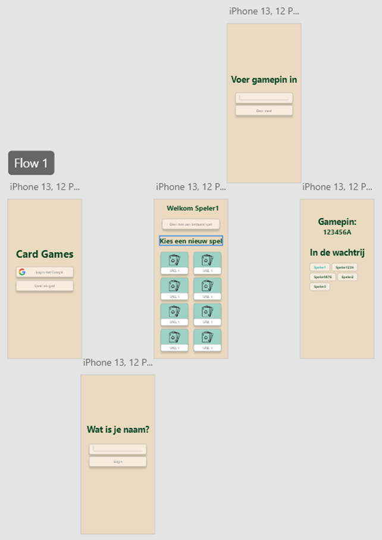
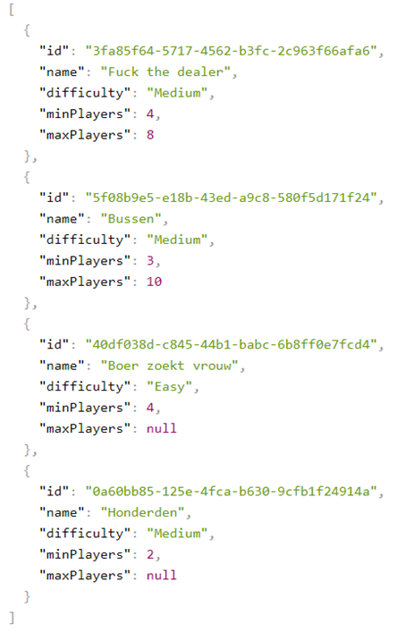
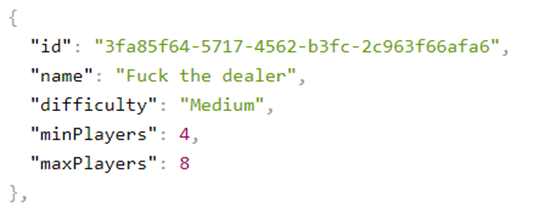
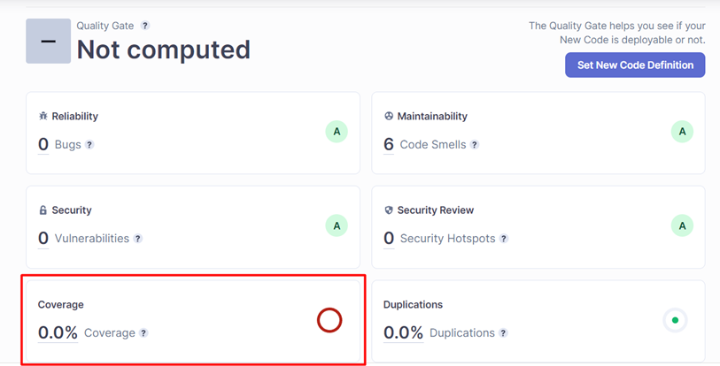
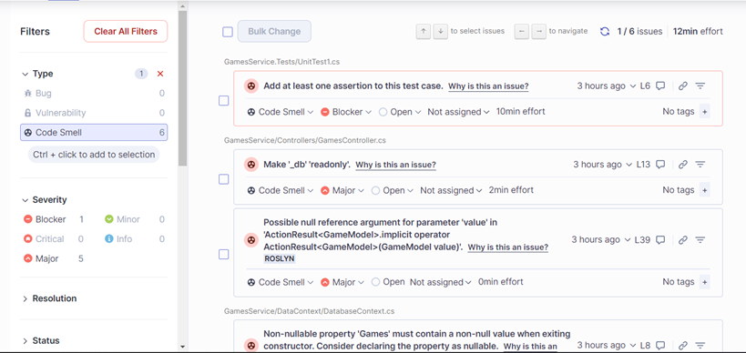
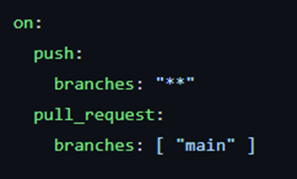

# Portfolio Semester 3

##### Naam: Brett Mulder

##### Klas: S3DB04

***

# Content
1. [Leerdoelen uitgelegd](https://github.com/Fontys-Brett-Mulder/CardGames/blob/main/Documentation/Portfolio_semester3.md#leerdoelen-uitgelegd)
2. [Full-stack Web Application](https://github.com/Fontys-Brett-Mulder/CardGames/blob/main/Documentation/Portfolio_semester3.md#full-stack-web-application)
3. [Software Quality](https://github.com/Fontys-Brett-Mulder/CardGames/blob/main/Documentation/Portfolio_semester3.md#software-quality)
4. [Agile Methods](https://github.com/Fontys-Brett-Mulder/CardGames/blob/main/Documentation/Portfolio_semester3.md#agile-methods)
5. [CI/CD](https://github.com/Fontys-Brett-Mulder/CardGames/blob/main/Documentation/Portfolio_semester3.md#cicd)
6. [Cultural differences and ethics](https://github.com/Fontys-Brett-Mulder/CardGames/blob/main/Documentation/Portfolio_semester3.md#cultural-differences-and-ethics)
7. [Requirements en Design](https://github.com/Fontys-Brett-Mulder/CardGames/blob/main/Documentation/Portfolio_semester3.md#requirements-en-design)
8. [Business Processes](https://github.com/Fontys-Brett-Mulder/CardGames/blob/main/Documentation/Portfolio_semester3.md#business-processes)
9. [Professional](https://github.com/Fontys-Brett-Mulder/CardGames/blob/main/Documentation/Portfolio_semester3.md#professional)

***

# Leerdoelen uitgelegd

#### 1. Full-stack Web Application

Je designd en bouwt een user-friendly, full-stack web applicatie.

#### 2. Software Quality

Je maakt gebruik van tooling en methodologydat continu aantoont dat de code verbeterd wordt tijdens het development
proces.

#### 3. Agile methods

Je kiest en implementeert de meest toepasselijke Agile methods voor je software project.

#### 4. CI/CD

Je designd en implementeert een (semi)automatische software release proces dat overeen komt met je project.

#### 5. Cultural differences and ethics

Je herkent en houdt rekening met culturele verschillen tussen project stakeholders en ethische aspecten bij
softwareontwikkeling.

#### 6. Requirements en Design

Je analyseert (geen functionele) requirements, designs en deze doet testen doormiddel van verschillende manieren van
tests.

#### 7. Business Processes

Je analyseert en beschrijft een simpel business proces dat overeen komt met je project.

#### 8. Professional

Je gedraagt je op een professionele manier tijdens het maken van je programma en het leren.
***

# Full-stack Web Application

Ik heb gekozen voor VueJS als front-end framework, deze keuzes heb ik beschreven in dit document. Ik ben gebruik gaan
maken van microservices (voor uitleg lees dit document), hierbij heb ik verschillende API’s. Deze API’s zijn gemaakt
doormiddel van ASP.net Core WebAPI.

## Design

Ik heb de keuze gemaakt om alleen een Design te maken voor mobiele versie. Dit heb ik gedaan omdat mijn doelgroep ligt
bij degene die kaartspellen vergeten zijn en toch een spel willen spelen. Je hebt altijd een telefoon op zak dus vandaar
alleen een mobiele versie.

## API

Voor de GamesService API heb ik de volgende structuur aan gehouden voor het ophalen van Games. De API
endpoint https://localhost:7099/api/Games/getAllGames geeft een lijst terug van games.

Een Game heeft bepaalde informatie, deze informatie is hieronder te zien.

***

# Software Quality

Voor het aantonen dat de code die geschreven wordt er goed uit ziet maak ik gebruik van SonarCloud. SonarCloud doet een
scan over mijn code en kijkt naar punten waar het beter kan. Bijvoorbeeld als een class readonly mag zijn, of consistent
gebruik van dezelfde hoofdletters bij functies, variables etc.

Bij elke push naar de “main” branch wordt er een check uitgevoerd. Deze uitslagen kan ik dan terugvinden in het
Dashboard van SonarCloud.

Hieronder zijn een paar uitslagen te zien, 1 van de 6 checks is rood gemarkeerd. Dit is omdat in dit geval er 0% van
mijn code wordt getest. Wanneer er wel meer code wordt getest zal in verloop van tijd het percentage omhoog gaan.

Bij maintainability wordt gekeken naar stukjes code die beter kunnen. Bijvoorbeeld: dit object moet readable zijn, of
een object moet non-nullable zijn etc.

***

# Agile Methods

## Scrum

Projectmanagement maak ik gebruik van scrum. Ik heb voor mezelf user stories gemaakt. Uit deze user stories kan ik
tickets halen die op mijn backlog komen te staan. Per sprint zal ik kijken welke user story ik kan oppakken. Hierbij ga
ik dan de tickets realiseren die bij de user story horen.

Bij de sprint planning worden alle tickets geperiodiseerd. Wanneer een ticket af is wordt deze naar done gesleept. Dat
betekend dat een gedeelte van de user story klaar is. Wanneer alle tickets af zijn van een user story dan zal als het
goed is de acceptatiecriteriavan het ticket ook klaar zijn.

Na elke sprint heb je een retrospective. Dit betekend dat je gaat kijken, wat ging goed en wat ging minder goed, welke
aandachtspunten zijn er? Etc. Normaal gesproken doe je dit met een groep en overleg je wat erbeter kan etc. Ik heb daar
de feedpulse voor. Hierin staat voor mij precies in wat ik gedaan heb en wat er beter kan etc.
***

# CI/CD

Ik heb voor mijn GamesService API een CI script gemaakt geschreven. Wanneer nieuwe code de “main” branch op wilt komen,
doormiddel van een direct Push of doormiddel van een Pull Request, wordt de CI uitgevoerd.De code hiervan is te vinden
in dit bestand. In dat bestand doe ik eigenlijk een paar dingen die ik hieronder ga uitleggen.

On → push → branches: “**”. Wanneer ik dus naar welke branch dan ook doe pushen, wordt dit bestand aangeroepen. Voor
pull requestst is het alleen op de “main” branch.

***

# Cultural differences and ethics

***

# Requirements en Design

## Requirements

Voor de requirements heb ik gebruik gemaakt van deze Youtube video. In deze video wordt precies uitgelegd hoe de
functionele en niet-functionele requirements van een applicatie er uit moeten komen te zien. Deze heb ik toegepast in
het “CardGames” document.

## Design

Voor het design van de applicatie heb ik een C4 model gemaakt. Dit C4 model staat beschreven in dit document.
***

# Business Processes
Voor een hele overzicht ga naar: [C4 Model Firgma](https://www.figma.com/file/veAOF6YmH4w2jec82FRp2w/C4-Model-CardGames?node-id=0%3A1)
# C1:

# C2:

# C3:

***

# Professional

Tijdens de proftaak opdracht met de groep Mediaan-DMA (proftaak groep 3 klas S3DB04) toon ik dit vooral aan. Hierin ga
ik professioneel op met mijn groepsgenoten. Hiervoor hebben we afspraken opgesteld waar we allemaal over hebben
ingestemd. Deze staan hier beschreven.

Voor het project ben ik de eerste sprint scrum master geweest. Dit betekend dat ik het bord van GitHub goed bij moest
houden en de groepsgenoten hierin moest begeleiden zodat ze dit ook gaan snappen.

Qua communicatie met de stakeholders gaat het goed. We hebben nu 1 oplevering gehad. Deze oplevering verliep soepen en
kregen complimenten over hoe goed de presentatie was.