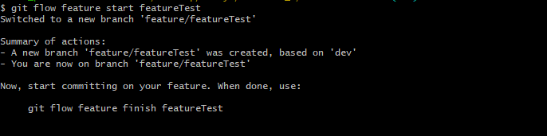
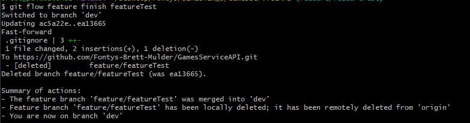

# Why this research?

I am writing this research about GitFlow because I to understand Git better. I used Git for more than 4 years now, but I
always have some conflicts in how to use it. In the beginning of this semester I read about GitFlow. GitFlow has gotten
my attention and therefore this research about it.

# Main question

- How I use GitFlow in my project?

# Sub-Questions

- What is GitFlow?
- What branches do I get?a
- What are other methods to use?
- Advantages and Disadvantages
- How to use GitFlow?
- How to use it with a group?
- Conclusion

---

# How I use GitFlow in my project?

---

## What is GitFlow?

GitFlow is an alternative Git branching model that involves the use of feature branches and multiple primary branches.
Because you use feature branches, the end commit to the main branch will be a lot bigger.

It was created by Vincent Driessen in 2010 and it is based in two main branches with infinite lifetime:

- **master**: this branch contains production code. All development code is merged into master in sometime.
- **develop**: this branch contains pre-production code. When the features are finished then they are merged into
  develop.

During the development cycle, a variety of supporting branches are used:

- **feature**-*: feature branches are used to develop new features for the upcoming releases. May branch off from
  develop and must merge into develop.
- **hotfix**-*: hotfix branches are necessary to act immediately upon an undesired status of master. May branch off from
  master and must merge into master anddevelop.
- **release**-*: release branches support preparation of a new production release. They allow many minor bug to be fixed
  and preparation of meta-data for a release. May branch off from develop and must merge into master anddevelop.

---

## What branches do I get?

- **main** (production): This branch will be the head of everyting, when anything is pushed here. It should be updated
  on a live website.
- **Development**: When developing a new version of you application, this branch will be the branch to make changes to
  when you finished a new feature. This branch is NOT on a live website, but will be the head of you development
  process.
- **Feature**: When you are going to be adding a new feature to your project, you need to checkout to a new branch
  from "
  Development". You can create your new feature. When you are done developing, create a pull request to "Development"
  branch. When this one is accepted, your new feature will be added to the "Development" branch.
- **Bugfix**: When there is a bug in your application. This one can be used. You have to checkout from "Development".
  And create a pull requets for the bugfix to "Development".

---

## Advantages and Disadvantages

//TODO: Image

#### Advantages

- Ensures a clean state of branches at any given moment in the life cycle of project
- The branches naming follows a systematic pattern making it easier to comprehend
- It has extensions and support on most used git tools
- It is ideal when there it needs to be multiple version in production

#### Disadvantages

- The Git history becomes unreadable
- The master/develop split is considered redundant and makes the Continuous Delivery and the Continuos Integration
  harder
- It isn’t recommended when it need to maintain single version in production

---

## What are other methods to use?

#### GitHub Flow

The GitHub Flow is a lightweight workflow.

This is the way I normally worked. //TODO: Image

1. You have to create a new branch from master. ````git checkout -b feature-branch````
2. From here you make your changes, then commit it to the ````feature-branch````
3. After that you create a merge request to the ````master```` branch
4. That merge request needs to be approved by some colleagues
5. When it is all approved it can be merged into master
6. After it is merged, your ````master```` branch can be deployed

#### OneFlow

The One Flow is a proposed alternative in article GitFlow considered harmful by Adam Ruka, written in 2015. The main
condition that needs to be satisfied in order to use OneFlow is that every new production release is based on the
previous release. The most difference between One Flow and Git Flow that it not has develop branch.

---

## How to use GitFlow?

When you have an existing repository. make sure you have no unstaged files. When everyting is clean type the command:

```console
git flow init
```

This will ask you some questions as seen on the image below.


After that you will be deirectly added to the "development" branch.

### GitFlow features

#### 1. When you are in the dev branch, you can easily start creating a new feature

```console
git flow feature start feature_branch
```

When running this command you wil be checked out to your new branch from dev



After that, you can work on your new feature. When you are done, you can commit and push to your feature branch like
always.

#### 2. Finishing your feature

When finishing your new feature, you put the command

````console
git flow feature finish feature_branch
````



This will merge your feature branch automatically into the "dev" branch. From here you can do it all over again, not oly
with a feature but also with a hotfix, bugfix etc.

---

## How to use it with a group?

When you are working in a group, the change of getting merge conflicts is a lot bigger. To resolve this as good as
possible you can use GitFlow. Every person is making a new feature for your application.

*First, follow the installation in the section above*

1. Create a new feature branch

```console
git flow feature start feature_branch
```

2. When you are done with your feature, you do not need to use ````git flow feature finish ...````, you have to use

```console
git flow feature publish feature_branch
```

You have to use publish because otherwise you cannot use a pull request. This means every developer can push changed
directly to the ````dev```` branch.

---

## Conclusion

When using GitFlow you have to follow some rules. As a developer you should not and cannot directly push to
the ````master / main```` branch. In some ways also not to the ````develop```` branch. You make agreements with your
team about how to use it.

You and your team will get a better view about how you project flow is going.

### Sources
- https://www.atlassian.com/git/tutorials/comparing-workflows/gitflow-workflow
- https://medium.com/@patrickporto/4-branching-workflows-for-git-30d0aaee7bf
- https://docs.gitlab.com/ee/topics/gitlab_flow.html
- https://docs.github.com/en/get-started/quickstart/github-flow
