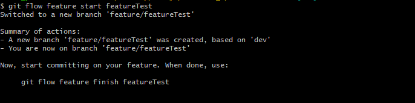
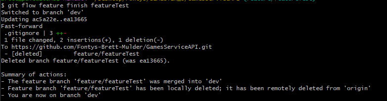

# GitFLow Research


# Content

1. [What is gitflow?](https://github.com/Fontys-Brett-Mulder/CardGames/edit/main/Research/GitFlow.research.md#wat-is-gitflow)
2. [Why to not push directly to the main branch?](https://github.com/Fontys-Brett-Mulder/CardGames/edit/main/Research/GitFlow.research.md#why-to-not-push-directly-to-the-main-branch)
3. [Usefull things with GitFlow](https://github.com/Fontys-Brett-Mulder/CardGames/edit/main/Research/GitFlow.research.md#usefull-things-with-gitflow)
4. [How to use GitFlow](https://github.com/Fontys-Brett-Mulder/CardGames/edit/main/Research/GitFlow.research.md#how-to-use-gitflow)
5. [GitFlow Features](https://github.com/Fontys-Brett-Mulder/CardGames/edit/main/Research/GitFlow.research.md#gitflow-features)
6. [Wich branches do you have?](https://github.com/Fontys-Brett-Mulder/CardGames/edit/main/Research/GitFlow.research.md#wich-branches-do-you-have)

# What is GitFlow?

Giflow is an alternative Git branching model that involves the use of feature branches and multiple primary branches.
Because you use feature branches, the end commit to the main branch will be a lot bigger.

# Why to not push directly to the main branch?

The main branch is the top level branch of your application. If something changes there, the live website will be
updated. When you edit this main branch, and it brakes it, the website will brake to. So in that case we use the
development branch. It is one level lower than the main branch. When everyting on the development branch works, you can
than add all of it to the main branch.

# Usefull things with GitFlow

When you start your project you have a few user stories. This user stories have some sort of defenition of done. One
User Story has multible features known as tickets on your board. This tickets have a id, when you add this id to a
special commit or branch name. You product owner knows what User Storie or ticket belongs to a commit.

# How to use GitFlow

When you have an existing repository. make sure you have no unstaged files. When everyting is clean type the command:

```console
git flow init
```

This will ask you some questions as seen on the image below.


After that you will be deirectly added to the "development" branch.

# GitFlow features

### 1. When you are in the dev branch, you can easily start creating a new feature

```console
git flow feature start feature_branch
```

When running this command you wil be checked out to your new branch from dev



After that, you can work on your new feature. When you are done, you can commit and push to your feature branch like
always.

### 2. Finishing your feature

When finishing your new feature, you put the command

````console
git flow feature finish feature_branch
````



This will merge your feature branch automatically into the "dev" branch. From here you can do it all over again, not oly
with a feature but also with a hotfix, bugfix etc.

# Wich branches do you have?

- main (production): This branch will be the head of everyting, when anything is pushed here. It should be updated on a
  live website.
- Development: When developing a new version of you application, this branch will be the branch to make changes to when
  you finished a new feature. This branch is NOT on a live website, but will be the head of you development process.
- Feature: When you are going to be adding a new feature to your project, you need to checkout to a new branch from "
  Development". You can create your new feature. When you are done developing, create a pull request to "Development"
  branch. When this one is accepted, your new feature will be added to the "Development" branch.
- Bugfix: When there is a bug in your application. This one can be used. You have to checkout from "Development". And
  create a pull requets for the bugfix to "Development".

# Sources

- https://www.atlassian.com/git/tutorials/comparing-workflows/gitflow-workflow
- https://docs.gitlab.com/ee/topics/gitlab_flow.html

