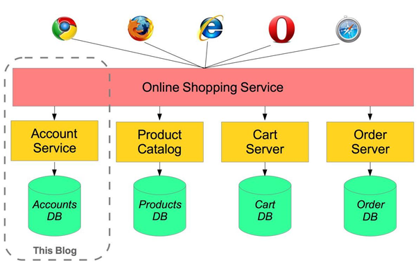
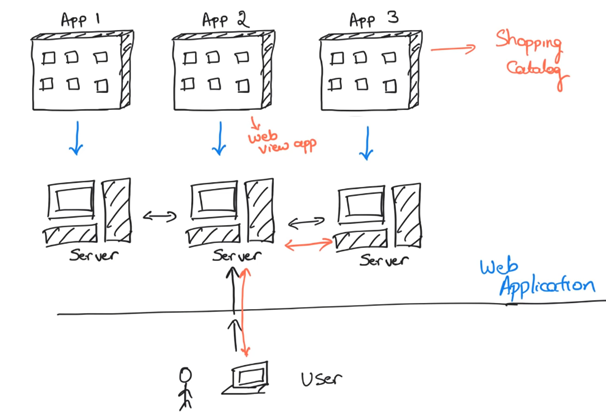

# Microservices Research
#### Wat is een microservice? Waar gebruik je het voor? Waarom wil je het gebruiken? Hoe zit het in elkaar? Lees het allemaal in dit document.

***

# Inhoud
***

# Wat is een microservice
**Microservice** – Ook bekend als microservice architectuur – het is een architectuur stijl dat je
applicatie structureertmet de verschillende services die je heb. Deze services zijn
- Goed onderhoudbaar en testbaar
- Van elkaar los gekoppeld
- Apart van elkaar te deployen
- Goed gescheden en elk team kan aan een andere service werken
- In bezit van een klein team.

De microservice-architectuur maar een snelle, frequente en betrouwbare levering van grote,
complexe applicaties mogelijk. Hierdoor is een bedrijf in staat op zijn team op te splitsen en je bent
dus niet afhankelijk van wat de ander doet op een service.

**Bron:** https://microservices.io/
***

# Structuur microservice
Hieronder zie je de structuur van een microservice. Een web applicatie is opgedeeld in verschillende
applicaties. Elk van deze applicaties draaien weer op andere servers. Om deze applicaties met elkaar
te laten communiceren zullen er rest/http request gemaakt moeten worden naar elkaar. Hierdoor
weet de ene applicatie wat de andere aan het doen is.

Doordat alles is opgesplitst van elkaar, kan een bedrijf makkelijker teams opsplitsen in verschillende
applicaties. Dit is mogelijk omdat alles dus in feite helemaal zou moeten werken zonder dat de
andere afhankelijk is.

Een anders voordeel van het opsplitsen van de applicaties is het verdelen van de workload op je
servers. Als voorbeeld:

#### Voorbeeld:
Je hebt een ticket verkoop, ineens komt er een piek van mensen. De server voor het regelen van de
kaartverkoop krijgt alle druk op zich, hierbij weet je dus dat je de capaciteit van de server moet
verhogen zonder dat je dit bij de andere servers hoeft te doen.

Zou je geen microservice gebruiken, dan zal je dus onnodig de server van je gehele applicatie moeten
verhogen, terwijl er eigenlijk maar 1 service verantwoordelijk is voor het probleem.

**Bron:** https://www.youtube.com/watch?v=j1gU2oGFayY&ab_channel=JavaBrains
***

# Samenvatting
Een microservice is dus heel handig als het gaat om de scalability van je applicatie. Je applicatie
wordt opgedeeld waardoor veel mensen tegelijk aan kunnen werken. Niemand hangt af van elkaar.
De workload wordt gegeven aan de service die er ook echt voor verantwoordelijk is. Al met al, een
en al voordelen!